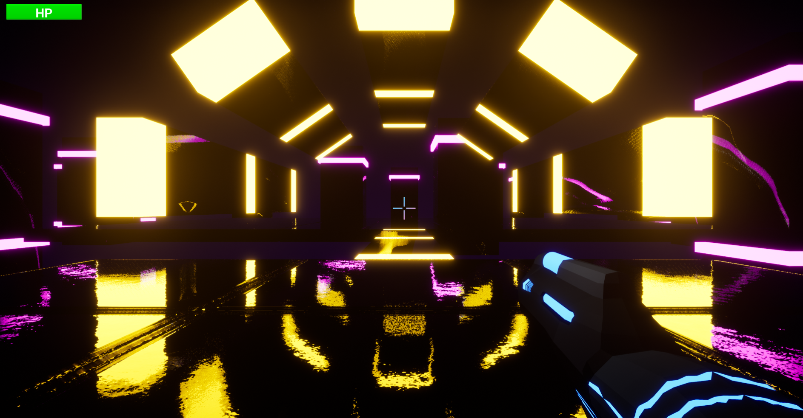

<h1 align="center">Glow Run</h1>
<table>
  <tr>
    <td></td>
    <td></td>
  </tr>
  <tr>
    <td></td>
    <td></td>
  </tr>
  <tr>
    <td></td>
    <td></td>
  </tr>
  <tr>
    <td></td>
    <td></td>
  </tr>
</table>

<h2>Project description</h2>
<b>Glow Run</b> is a first-person shooter platformer developed in <b>Unreal Engine 4</b> using the Blueprint visual scripting system. Created as part of a university assignment, the game features animated gameplay, an engaging GUI, and five progressively challenging levels.

<h2>Features</h2>
<ul>
  <li>First-person gameplay with a custom gun modeled in Blender</li>
  <li>5 carefully designed levels with increasing difficulty</li>
  <li>Bright, glowing, cyberpunk-inspired visual style</li>
  <li>Smooth player controls and responsive shooting mechanics</li>
  <li>Custom user interface: main menu, pause, game over, level selection, and end screen</li>
  <li>Enemies that shoot projectiles, and laser obstacles</li>
  <li>Limited health system with an on-screen HP bar</li>
  <li>Save and continue game functionality</li>
</ul>

<h2>Technologies Used</h2>
🎮 <b>Game Engine:</b> Unreal Engine 4 
🧩 <b>Programming:</b> Blueprint visual scripting 
🎨 <b>Design Tools:</b> Blender (3D modeling), Photoshop (UI design) 

<h2>Getting Started</h2>
To get a local copy up and running, follow these simple steps.

<h3>Prerequisites</h3>
Make sure you have <b>Unreal Engine 4</b> installed.

<h3>Installation</h3>
Clone the repository: 
https://github.com/Yuliia-Kruta/GlowRun.git

<h3>Open the Project in Unreal Engine 4</h3>
<ol>
  <li>Open <b>Unreal Engine 4</b> from the Epic Games Launcher.</li>
  <li>Click <b>Browse</b> and navigate to the folder where the project is located.</li>
  <li>Open the <code>PracticeGameFPS.uproject</code> file.</li>
  <li>If prompted to rebuild project files or convert to your engine version, confirm (make sure you’re using a compatible version).</li>
</ol>

<h3>Run the Game</h3>
<ol>
  <li>Once the editor opens, click <b>Play</b> to run the game inside the editor.</li>
  <li>Alternatively, you can package the project for your platform via <b>File &gt; Package Project</b> and then run the generated <code>.exe</code> or equivalent file to play the standalone version.</li>
</ol>

<h2>How to Play</h2>
<ol>
  <li>Launch the game to open the Main Menu.</li>
  <li>Select:
    <ul>
      <li><code>Continue</code> – resume a previously saved game</li>
      <li><code>New Game</code> – start a new game</li>
      <li><code>Levels</code> – view unlocked levels</li>
      <li><code>Quit</code> – exit the game</li>
    </ul>
  </li>
  <li>Use <b>WASD</b> or <b>Arrow Keys</b> to move.</li>
  <li>Press <b>Left Mouse Button</b> to shoot.</li>
  <li>Defeat all enemies and reach the end of the level to proceed.</li>
  <li>Avoid laser traps and don’t fall - your health is shown in the HP bar.</li>
  <li>The game ends when your health reaches 0 or you fall. A <b>Game Over</b> screen will be shown.</li>
</ol>

<h2>Contributors</h2>
This project was created by Yuliia Kruta and Dmytro Pozharov (group name - DJ Development) for Year 1 Practice at NaUKMA.

<h2>License</h2>
Distributed under the MIT License. See LICENSE for more information.
